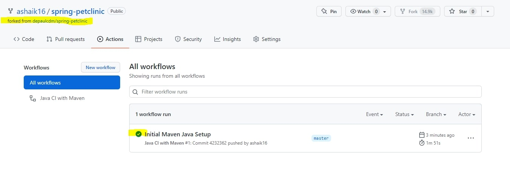
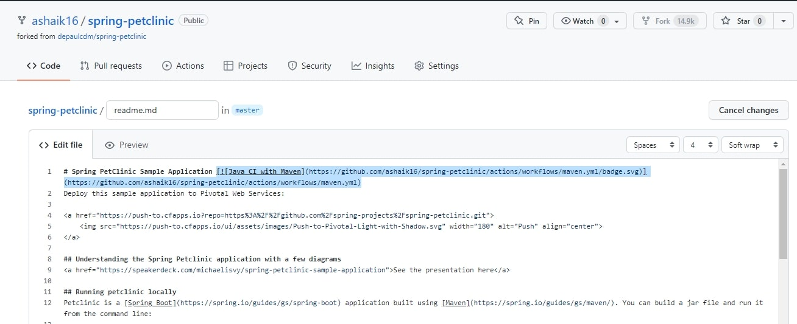
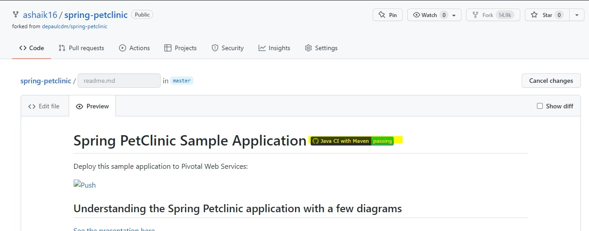
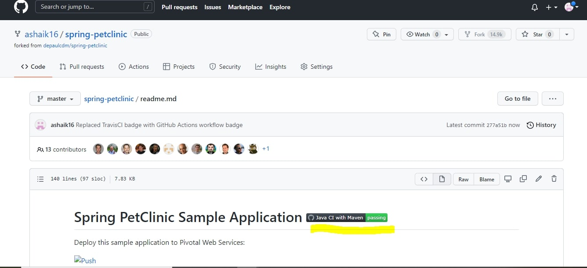
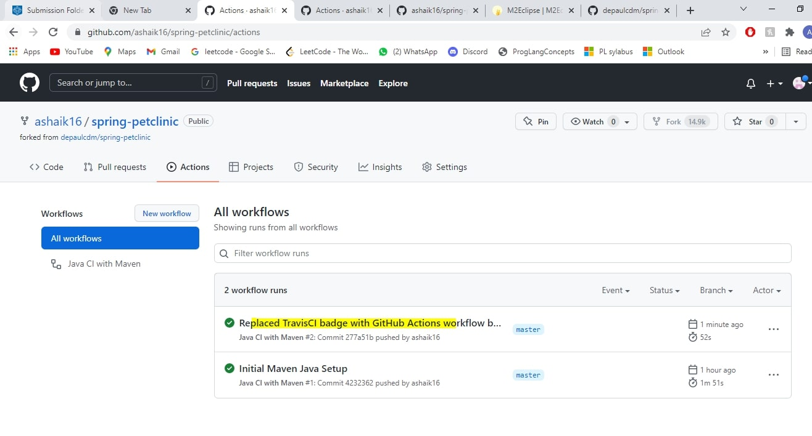
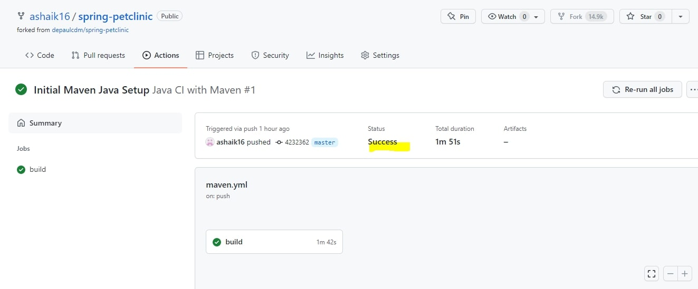
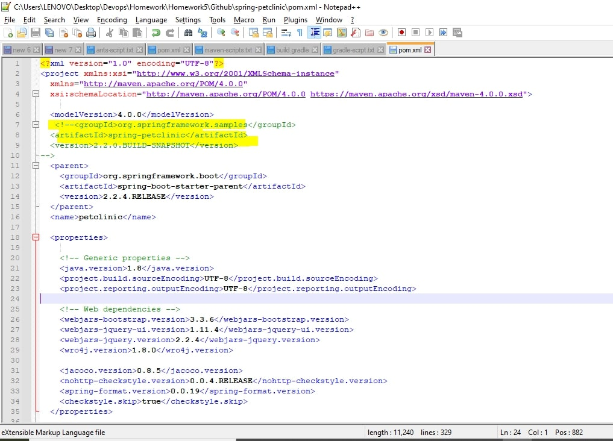

# Instructions
**TODO:** Name: Anam Arif Shaikh StudentId: 1986958 .
```

```
The first argument is the Alt-text for the image. The second argument is the path to the image. Make sure your images are readable and that you save them in a JPG or PNG format.

- [5 pts]  Your GitHub account showing that is has been forked from the depaulcdm/spring- petclinic repository. This doesn’t actually need an image – I can see it from your repository.

- [5 pts] Your GitHub Actions dashboard showing a successful first build.

- [5 pts] Your GitHub repository with the readme.md file selected showing the code that you changed to update the badge.


- [5 pts] Your GitHub repository with the readme.md file selected showing the build success status after you’ve updated the badge markdown.



- [5 pts] The section of the POM file showing the coordinates after you’ve commented them out.

**Pushing pom file changes** 
- [5 pts] Your GitHub Actions dashboard showing the unsuccessful build after the breaking change.
 
- [5 pts] Your GitHub repository with the readme.md file selected showing the build failed status after the GitHub workflow fails.
 
- [5 pts] The section of the POM file showing the coordinates after you’ve fixed them.xml

- [5 pts] Your GitHub Actions dashboard showing the successful build after the breaking change has been fixed.
 
- [5 pts] Your GitHub repository with the readme.md file selected showing the build success status after the GitHub workflow has recovered.
 


